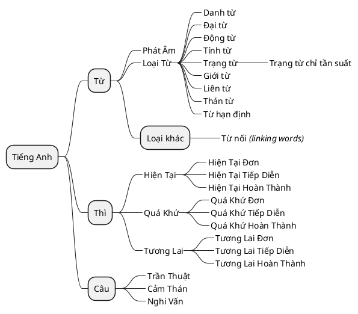

# English

## Tiếng Anh là

Là Tiếng Anh

## Các Khái Niệm
## Lộ Trình Học

- __Phát Âm__, 
- __Từ__ chỉ 

## Lộ Trình Học

## Các Loại Từ

Tiếng anh trong sách có 8 loại từ (chắc thế)

| Tên                           | Mô tả                                                                                      | Ví dụ                 |
| :---------------------------- | :----------------------------------------------------------------------------------------- | :-------------------- |
| __Nouns (Danh từ)__           | Đặt tên cho người, địa điểm, đồ vật hoặc ý tưởng.                                          | _cat, city, love_     |
| __Pronouns (Đại từ)__         | Thay thế danh từ để tránh lặp lại.                                                         | she, it, they_        |
| __Verbs (Động từ)__           | Mô tả hành động, trạng thái hoặc sự kiện.                                                  | _run, is, happened_   |
| __Adjectives (Tính từ)__      | Mô tả hoặc sửa đổi danh từ.                                                                | _happy, large, blue_  |
| __Adverbs (Trạng từ)__        | Mô tả hoặc sửa đổi động từ, tính từ hoặc trạng từ khác.                                    | _quickly, very, well_ |
| __Prepositions (Giới từ)__    | Hiển thị mối quan hệ giữa danh từ (hoặc đại từ) và các từ khác trong câu.                  | _on, at, between_     |
| __Conjunctions (Liên từ)__    | Kết nối các từ, cụm từ hoặc mệnh đề.                                                       | _and, but, because_   |
| __Interjections (Thán từ)__   | Thể hiện cảm xúc mạnh mẽ hoặc cảm xúc bộc phát đột ngột.                                   | wow, ouch, hey        |
| __Determiners (Từ hạn định)__ | Giới thiệu danh từ và cung cấp thông tin về số lượng, tính xác định hoặc sở hữu của chúng. | _the, some, my_       |

### Pronouns (Đại từ)

> Thay thế danh từ để tránh lặp lại.

1. __Đại từ nhân xưng__ _(Personal Pronouns)_: I, you, he, she, it, we, they
1. __Đại từ sở hữu__ _(Possessive Pronouns)_: mine, yours, his, hers, its, ours, theirs
1. __Đại từ phản thân__ _(Reflexive Pronouns)_: myself, yourself, himself, herself, itself, ourselves, themselves
1. __Đại từ quan hệ__ _(Relative Pronouns)_: who, whom, whose, which, that
1. __Đại từ chỉ định__ _(Demonstrative Pronouns)_: this, that, these, those
1. __Đại từ bất định__ _(Indefinite Pronouns)_: someone, anyone, everyone, nobody, something, anything, everything
1. __Đại từ nghi vấn__ _(Interrogative Pronouns)_: who, what, which, whom, whose

### Verbs (Động từ)

> Mô tả hành động, trạng thái hoặc sự kiện.

1. __Động từ hành động__ _(Action Verbs)_: run, jump, swim, write, dance, sing, cook
1. __Động từ trạng thái__ _(State-of-Being Verbs)_: be, seem, appear, exist, belong
1. __Động từ ngoại động__ _(Transitive Verbs)_: eat, throw, give, make, bring (these require an object)
1. __Động từ nội động__ _(Intransitive Verbs)_: sleep, cry, go, arrive, sneeze (these don’t require an object)
1. __Động từ trợ giúp (trợ động từ)__ _(Helping Verbs)_: am, is, are, was, were, do, did, have, has, can, will
1. __Động từ khiếm khuyết (động từ modal)__ _(Modal Verbs)_: can, could, may, might, must, shall, should, will, would

### Adjectives (Tính từ)

> Mô tả hoặc sửa đổi danh từ.

1. __Tính từ miêu tả__ _(Descriptive Adjectives)__: beautiful, tall, shiny, delicious, cold, bright
1. __Tính từ so sánh__ _(Comparative Adjectives)__: bigger, taller, faster, stronger, happier
1. __Tính từ cấp cao nhất__ _(Superlative Adjectives)__: biggest, tallest, fastest, strongest, happiest
1. __Tính từ sở hữu__ _(Possessive Adjectives)__: my, your, his, her, its, our, their
1. __Tính từ chỉ định__ _(Demonstrative Adjectives)__: this, that, these, those
1. __Tính từ định lượng__ _(Quantitative Adjectives)__: some, many, few, several, all
1. __Tính từ nghi vấn__ _(Interrogative Adjectives)__: which, what, whose

### Adverbs (Trạng từ)

> Mô tả hoặc sửa đổi động từ, tính từ hoặc trạng từ khác.

1. __Trạng từ chỉ cách thức__ _(Adverbs of Manner)_: quickly, slowly, beautifully, loudly, silently
1. __Trạng từ chỉ thời gian__ _(Adverbs of Time)_: yesterday, today, soon, later, now
1. __Trạng từ chỉ nơi chốn__ _(Adverbs of Place)_: here, there, nearby, outside, everywhere
1. __Trạng từ chỉ tần suất__ _(Adverbs of Frequency)_: always, sometimes, never, often, rarely
1. __Trạng từ chỉ mức độ__ _(Adverbs of Degree)_: very, too, quite, almost, extremely

### Prepositions (Giới từ)

> Hiển thị mối quan hệ giữa danh từ (hoặc đại từ) và các từ khác trong câu.

1. __Giới từ chỉ địa điểm__ _(Prepositions of Place)_: in, on, at, under, over, between, behind, beside
1. __Giới từ chỉ thời gian__ _(Prepositions of Time)_: before, after, during, since, until, at, on, in
1. __Giới từ chỉ hướng__ _(Prepositions of Direction)_: to, into, onto, out of, from, toward
1. __Giới từ chỉ cách thức__ _(Prepositions of Manner)_: by, with, like, as
1. __Giới từ chỉ nguyên nhân hoặc lý do__ _(Prepositions of Cause)_: because of, due to, thanks to
1. __Giới từ chỉ sự sở hữu__ _(Prepositions of Possession)_: of, about, for

### Conjunctions (Liên từ)

> Kết nối các từ, cụm từ hoặc mệnh đề.

1. __Liên từ kết hợp__ _(Coordinating Conjunctions)_: for, and, nor, but, or, yet, so
1. __Liên từ phụ thuộc__ _(Subordinating Conjunctions)_: because, although, since, if, when, while, unless
1. __Liên từ tương quan__ _(Correlative Conjunctions)_: either...or, neither...nor, both...and, not only...but also

### Interjections (Thán từ)

> Thể hiện cảm xúc mạnh mẽ hoặc cảm xúc bộc phát đột ngột.

1. __Wow!__ – bày tỏ sự ngạc nhiên hoặc ngưỡng mộ.
1. __Ouch!__ – thể hiện nỗi đau.
1. __Yay!__ – thể hiện niềm vui hoặc sự phấn khích.
1. __Oops!__ – thể hiện một sai lầm hoặc tai nạn nhỏ.
1. __Hmm...__ – cho thấy suy nghĩ hoặc do dự.
1. __Ugh!__ – thể hiện sự khó chịu hoặc ghê tởm.
1. __Ahh...__ – Thể hiện sự nhẹ nhõm hoặc thư giãn.

### Determiners (Từ hạn định)

> Giới thiệu danh từ và cung cấp thông tin về số lượng, tính xác định hoặc sở hữu của chúng

1. __Mạo từ__ _(Articles)__: a, an, the
2. __Từ chỉ định__ _(Demonstratives)_: this, that, these, those
3. __Từ sở hữu__ _(Possessives)_: my, your, his, her, its, our, their
4. __Từ chỉ số lượng__ _(Quantifiers)_: some, many, few, several, much, all, no
5. __Số đếm__ _(Numbers)_: one, two, three, etc.
6. __Từ phân bổ__ _(Distributives)_: each, every, either, neither
7. __Từ nghi vấn__ _(Interrogatives)_: which, what, whose

## Câu

### Câu trần thuật (Declarative Sentence)

- Ý nghĩa: Dùng để đưa ra một tuyên bố hoặc thông tin.
- Cấu trúc câu trần thuật: `Subject + Verbs + Object`
- Ví dụ: I love learning new things.

### Câu nghi vấn (Interrogative Sentence)

#### Câu nghi vấn dạng Yes-No
- Ý nghĩa: Dùng để đưa ra một tuyên bố hoặc thông tin.
- Cấu trúc câu trần thuật: `Be + Subject + Object`
- Ví dụ: I love learning new things.

#### Câu nghi vấn Wh-
- Ý nghĩa: Dùng để đưa ra một tuyên bố hoặc thông tin.
- Cấu trúc câu trần thuật: `Wh- + (be/do) + Subject + Verbs`
- Ví dụ: I love learning new things.

### Câu cảm thán (Exclamatory Sentence)
- Ý nghĩa: Dùng để đưa ra một tuyên bố hoặc thông tin.
- Cấu trúc câu trần thuật: `Be + Subject + Object`
- Ví dụ: I love learning new things.

#### Câu cảm thán với ''WHAT'' theo những cấu trúc như sau:

- `What + a/an + Adjectives + {danh từ đếm được}`
- `What + Adjectives + {danh từ đếm được số nhiều} + (be)`
- `What + Adjectives + {danh từ không đếm được}`
- `What + a/an + Adjectives + Noun + Subject + Verbs`

#### Cấu trúc câu cảm thán với “How”

- `How + Adjectives/Adverb + Subject + Verbs/be!`

#### Cấu trúc câu cảm thán với “SO” Và “SUCH”