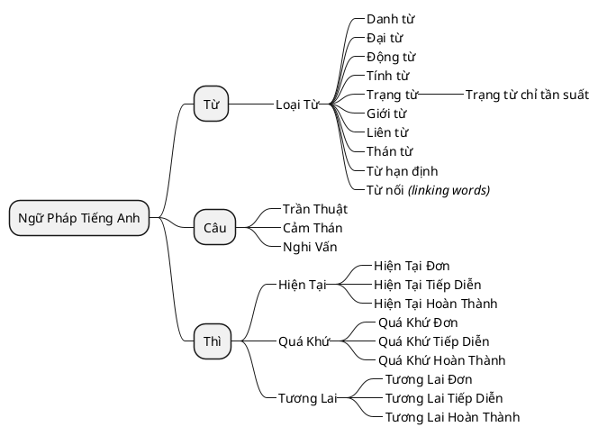

# English

## Tiếng Anh là

Là Tiếng Anh

## Các Khái Niệm
## Lộ Trình Học

```puml
@startmindmap
skinparam backgroundcolor transparent

* Ngữ Pháp Tiếng Anh
** Từ
***_ Loại Từ
****_ Danh từ
****_ Đại từ
****_ Động từ
****_ Tính từ
****_ Trạng từ
*****_ Trạng từ chỉ tần suất
****_ Giới từ
****_ Liên từ
****_ Thán từ
****_ Từ hạn định
****_ Từ nối //(linking words)//

** Câu
***_ Trần Thuật
***_ Cảm Thán
***_ Nghi Vấn

** Thì
***_ Hiện Tại
****_ Hiện Tại Đơn
****_ Hiện Tại Tiếp Diễn
****_ Hiện Tại Hoàn Thành
***_ Quá Khứ
****_ Quá Khứ Đơn
****_ Quá Khứ Tiếp Diễn
****_ Quá Khứ Hoàn Thành
***_ Tương Lai
****_ Tương Lai Đơn
****_ Tương Lai Tiếp Diễn
****_ Tương Lai Hoàn Thành

@endmindmap
```

## Câu

### Câu trần thuật (Declarative Sentence)

- Ý nghĩa: Dùng để đưa ra một tuyên bố hoặc thông tin.
- Cấu trúc câu trần thuật: `Subject + Verbs + Object`
- Ví dụ: I love learning new things.

### Câu nghi vấn (Interrogative Sentence)

#### Câu nghi vấn dạng Yes-No
- Ý nghĩa: Dùng để đưa ra một tuyên bố hoặc thông tin.
- Cấu trúc câu trần thuật: `Be + Subject + Object`
- Ví dụ: I love learning new things.

#### Câu nghi vấn Wh-
- Ý nghĩa: Dùng để đưa ra một tuyên bố hoặc thông tin.
- Cấu trúc câu trần thuật: `Wh- + (be/do) + Subject + Verbs`
- Ví dụ: I love learning new things.

### Câu cảm thán (Exclamatory Sentence)
- Ý nghĩa: Dùng để đưa ra một tuyên bố hoặc thông tin.
- Cấu trúc câu trần thuật: `Be + Subject + Object`
- Ví dụ: I love learning new things.

#### Câu cảm thán với ''WHAT'' theo những cấu trúc như sau:

- `What + a/an + Adjectives + {danh từ đếm được}`
- `What + Adjectives + {danh từ đếm được số nhiều} + (be)`
- `What + Adjectives + {danh từ không đếm được}`
- `What + a/an + Adjectives + Noun + Subject + Verbs`

#### Cấu trúc câu cảm thán với “How”

- `How + Adjectives/Adverb + Subject + Verbs/be!`

#### Cấu trúc câu cảm thán với “SO” Và “SUCH”