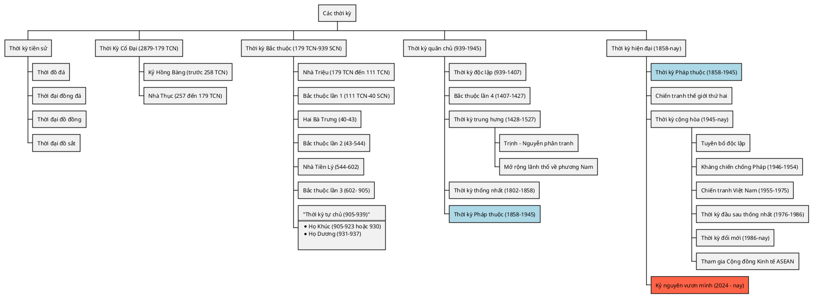

# Tổng quan các thời kỳ

## Tóm tắt

## Thời kỳ tiền sử

Nước Việt Nam cũng có thời tiền sử. Có các di chỉ khảo cổ và người Việt Cổ _(người bản địa sinh sống ở mảnh đất này)_.

- __Thời đồ đá__:
    - Di chỉ từ các di tích ở hang Thẩm Hoi, Thẩm Khuyên (Lạng Sơn), núi Đọ (Thanh Hóa), Thung Lang (Ninh Bình) và Nga Sơn, Thanh Hóa, ... đã chứng minh có dấu vết người thượngg cổ sinh sống ở mảnh đất này cách đây hàng trăm nghìn năm.
- __Thời đại đồng đá__:
    - Phùng Nguyên là tên một làng ở xã Kinh Kệ, huyện Lâm Thao, tỉnh Phú Thọ. Tại đây các nhà khoa học đã tìm thấy các bằng chứng về một nền văn minh đồ đồng cách đây chừng 4.000 năm đến 3.500 năm.
- __Thời đại đồ đồng__:
    - __Văn hóa Đồng Đậu__ là nền văn hóa thuộc thời kỳ đồ đồng ở Việt Nam cách ngày nay khoảng 3.000 năm, sau văn hóa Phùng Nguyên, trước văn hóa Gò Mun. Tên của nền văn hóa này đặt theo tên khu di tích Đồng Đậu ở thị trấn Yên Lạc, huyện Yên Lạc, tỉnh Vĩnh Phúc.
- __Thời đại đồ sắt__:
    - Đến khoảng năm 1200 TCN, dân cư cho thấy sự phát triển của kỹ thuật trồng lúa nước.
    - Các vũ khí, dụng cụ và trống đồng được khai quật của __văn hóa Đông Sơn__ minh chứng cho việc kỹ thuật đúc đồ đồng bắt nguồn từ đây.
    - Ở miền Bắc Việt Nam, các nhà khảo cổ đã tìm thấy quan tài và lọ chôn hình thuyền, nhà sàn, và bằng chứng về __phong tục ăn trầu và nhuộm răng đen__.

## Thời kỳ cổ đại (2879–179 TCN)

### Kỷ Hồng Bàng (?–258 TCN)

- __Truyền thuyết về nước Xích Quỷ__
    - Có vẻ như đây là nơi khởi nguyên () của dân tộc Việt Nam. Một bộ phận bộ lạc những người Bách Việt đã tách ra từ đất nước này ở tỉnh Hồ Nam ___(Trung Quốc)___.
    - Có điều sự thật xác nhận nhà nước này có tồn tại hay không thì không ai rõ.
- __Nước Văn Lang__ ___(Thế kỷ VII–258 TCN hoặc 218 TCN)___: Nhà nước đầu tiên của nước ta sau khi tách ra từ nước __Xích Quỷ__
    - Nước __Văn Lang__ của người __Lạc Việt__. Có niên đại rất lâu và tồn tại khá dài.
    - Đất nước này cũng gắn với truyền thuyết về ___Vua Hùng___, ___Sơn tinh Thủy tinh___, ...

### Nhà Thục (257 hoặc 208 TCN – 179 TCN)

- Thục Phán đánh bại __Hùng Vương thứ 18__ lập nên nhà nước Âu Lạc. Xưng là __An Dương Vương__.
- Triệu Đà thôn tính nước Âu Lạc.

## Thời kỳ Bắc thuộc (179 TCN–939 SCN)

#### Bắc thuộc lần 1 (111 TCN–40 SCN)

Sau khi Triệu Đà chiếm được lãnh thổ, nước ta nằm dưới sự quản hạt của nhà Tần. (trong Tam Quốc)

#### Hai Bà Trưng (40–43)

- Hai Bà Trưng khởi nghĩa chống cường quyền. Cuộc khởi nghĩa thành công.
- Sau 3 năm, nhà Hán sai Mã Viện sang đàn áp.

#### Bắc thuộc lần 2 (43–544)

- Đất nước lần lượt bị quản lý bởi nhiều triều đại khác nhau, dưới danh nghĩa như là một tỉnh của Trung Quốc. Người nắm quyền được gọi là Thái Thú.
- Thời kỳ này cũng có vài cuộc khởi nghĩa nhưng không thành công.

#### Nhà Tiền Lý (544–602)

- Năm 541, __Lý Bí__ nổi dậy đánh đuổi được thứ sử lập ra nhà Lý.
- Liên tiếp nhiều cuộc chiến thắng thành công trước nhà Lương, __Lý Bí__ quyết định xưng vương, hiệu __Lý Nam Đế__, lấy tên nước là __Vạn Xuân__
- __Lý Nam Đế__ mất, đất nước hỗn loạn một thời gian.
- __Triệu Quang Phục__ lên nắm quyền, xưng __Triệu Việt Vương__, lập ra nhà __Triệu__
- Năm 602, nhà Tùy sang đánh và đất nước lại rơi vào thời kỳ Bắc thuộc.

#### Bắc thuộc lần 3 (602– 905)

- Kế tiếp nhà Tùy, nhà Đường đô hộ Việt Nam gần 300 năm
- Các cuộc khởi nghĩa thời kỳ này khá nhiều nhưng đều thất bại.

#### Thời kỳ tự chủ (905–939)

##### Họ Khúc (905–923 hoặc 930)

- Khúc Thừa Dụ đã xây dựng chính quyền tự chủ của người Việt, đặt nền móng cho nền độc lập của Việt Nam.

##### Họ Dương (931-937)

- Dương Đình Nghệ cố gắng khôi phục Giao Châu.
- Kiều Công Tiễn sát hại Dương Đình Nghệ.
- Ngô Quyền giết Kiều Công Tiễn.

## Thời kỳ quân chủ (939–1858)

- Ngô Quyền đánh thằng quân Nam Hán trên sông Bạch Đằng.
- Đinh Bộ Lĩnh dẹp loạn 12 sứ quân.
- Lê Hoàn soán ngôi nhà Đinh lập nhà Tiền Lê.
- Lý Công Uẩn lên ngôi lập là Lý. Lập tên nước thành __Đại Việt__

### Thời kỳ độc lập (939–1407)

### Bắc thuộc lần 4 (1407–1427)

- Quân Minh sang xâm lược Đại Ngu với cớ đánh đuổi nhà Hồ khôi phục nhà Trần (Phù Trần diệt Hồ).
- Quân Minh nhanh chóng đánh bại quân __Đại Ngu__, đất nước lại rơi vào Bắc thuộc lần 4.
- Lê Lợi khởi nghĩa chống lại nhà Minh.
- Khởi nghĩa Lam Sơn thắng lợi. Lê Lợi lên ngôi hoàng đế, lập nhà Hậu Lê.

### Thời kỳ trung hưng (1428–1527)

Việt Nam giai đoạn này trải qua nhiều chế độ phong kiến: Nhà Mạc (1527–1592), nhà Lê trung hưng (1533–1789), chúa Trịnh (1545–1787), chúa Nguyễn (1558–1777) và nhà Tây Sơn (1778–1802).

#### Trịnh – Nguyễn phân tranh

- Sự mâu thuẫn giữa hai người cận thần của nhà Lê trung hưng là Trịnh Kiểm và Nguyễn Hoàng đã bắt đầu cho sự phân chia đất nước ra thành hai lãnh thổ.
- Hai chính quyền riêng biệt là __Đàng Ngoài__ và __Đàng Trong__.
- Con cháu của Trịnh Kiểm lần lượt kế tiếp nhau nắm quyền ở Đàng Ngoài được gọi là các __chúa Trịnh__
- Các con cháu của Nguyễn Hoàng kế tiếp nhau cầm quyền ở Đàng Trong được gọi là các __chúa Nguyễn__

#### Mở rộng lãnh thổ về phương Nam

Tiếp đó, sau các cuộc di dân của người Việt từ Đàng Trong vào sinh sống ở vùng đất của người Khmer, các chúa Nguyễn lần lượt thiết lập chủ quyền từng phần trên vùng đất Nam Bộ, sau các cuộc chiến với vương quốc Khmer, vương quốc Ayutthaya cũng như các yếu tố chính trị khác, từ năm 1698 đến năm 1757, chính quyền Đàng Trong đã giành được hoàn toàn Nam Bộ ngày nay vào sự kiểm soát của mình.

### Thời kỳ thống nhất (1802–1858)

- Nhà Tây Sơn đã đánh bại 5 vạn quân Xiêm La (năm 1784) tại miền Nam và 29 vạn quân Mãn Thanh (năm 1789) xâm lược tại miền Bắc.
- Vua Tây Sơn là __Nguyễn Huệ__ chính thức trở thành vua của Đại Việt, lấy niên hiệu là __Quang Trung__, thống nhất hầu hết lãnh thổ từ miền Bắc vào tới Gia Định.

## Thời kỳ hiện đại (1858–nay)

### Thời kỳ Pháp thuộc (1858–1945)

- Ngày 31 tháng 8 năm 1858, Hải quân Pháp đổ bộ tấn công vào cảng Đà Nẵng và sau đó rút vào xâm chiếm Sài Gòn.
- __Phong trào Cần Vương__ thất bại
- __Phan Châu Trinh__ và __Phan Bội Châu__ đã mở đầu cho __Phong trào Duy Tân__ và __Phong trào Đông Du__, hướng dẫn người Việt tiếp cận văn hóa phương Tây.
- Người Việt cấp tiến dưới ảnh hưởng của Chủ nghĩa Tam Dân đã thành lập __Việt Nam Quốc dân Đảng__.
- Cùng năm đó, một số thanh niên Việt Nam theo Chủ nghĩa Marx-Lenin thành lập __Đảng Cộng sản Đông Dương__.

### Chiến tranh thế giới thứ hai

- Nhật Bản tấn công Đông Dương.
- Nhật Bản cai trị Đông Dương.

### Thời kỳ cộng hòa (1945–nay)
#### Tuyên bố độc lập

- <mark class=red>__Ngày 2 tháng 9 năm 1945 tại Hà Nội, Hồ Chí Minh tuyên bố thành lập nước Việt Nam Dân chủ Cộng hòa độc lập và thống nhất từ miền Bắc tới miền Nam.__</mark>

#### Kháng chiến chống Pháp (1946–1954)

- Trận Điện Biên Phủ
- Hiệp định Genève

#### Chiến tranh Việt Nam (1955–1975)

- __Mặt trận Dân tộc Giải phóng miền Nam Việt Nam__ ra đời và chính quyền __Việt Nam Dân chủ Cộng hòa__
- Đầu năm 1968, __Chiến dịch Tết Mậu Thân__
- Sau __Hiệp định Paris 1973__, quân viễn chinh Mỹ rút khỏi Việt Nam 

#### Thời kỳ đầu sau thống nhất (1976–1986)

- __Việt Nam Dân chủ Cộng hòa__ và __Cộng hòa miền Nam Việt Nam__ tổ chức Tổng tuyển cử để thống nhất về mặt nhà nước thành một quốc gia có tên chính thức là __Cộng hòa Xã hội chủ nghĩa Việt Nam__.
- Năm 1977, Việt Nam trở thành thành viên của Liên Hợp Quốc.
- Quân đội Việt Nam phản công và lật đổ quân Khmer Đỏ
- 

#### Thời kỳ đổi mới (1986–nay)

- Việt Nam phát triển kinh tế

#### Tham gia Cộng đồng Kinh tế ASEAN

- Việt Nam tham gia vào cộng đồng phát triển chung __ASEAN__

#### Kỷ nguyên vươn mình (2024 - nay)

- __Ngày 23 tháng 9 năm 2024__: tại Đại học Columbia, Tổng bí thư Tô Lâm đã phát biểu rằng sau gần 80 năm thành lập đất nước và gần 40 năm đổi mới, dưới sự lãnh đạo của Đảng Cộng sản, Việt Nam đang bước vào một giai đoạn lịch sử mới. Ông đã nhấn mạnh rằng đây là kỷ nguyên phát triển của Dân tộc. Từ đầu năm 2025 đến nay, việc cải cách hành chính, sắp xếp tinh gọn bộ máy từ cấp trung ương đến địa phương được diễn ra quyết liệt, theo tinh thần "vừa chạy, vừa xếp hàng" mà Nhà nước đề ra, đến 30/6/2025, cả nước hoàn thành cơ bản việc tinh gọn bộ máy từ cấp trung ương đến địa phương.

