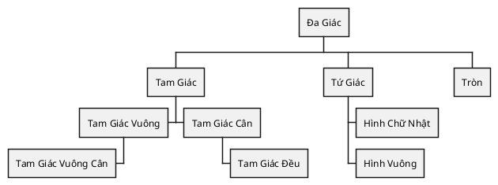
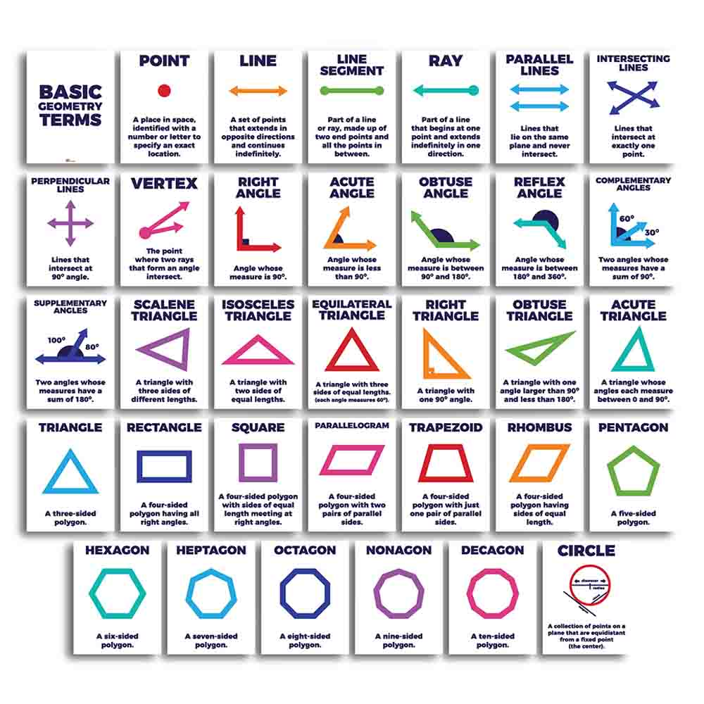

# Cơ bản về Hình học

## Các phần tử của hình học

### Các phần tử cơ bản

- __Điểm__: Một _dấu chấm nhỏ_ được gọi là điểm. Điểm được dùng xác định một vị trí nhỏ trên bản đồ. Theo khái niệm điểm đơn thuần là vị trí, phóng to điểm vẫn là điểm.
- __Đoạn thẳng__: Đoạn thằng là đường nối hai điểm.
- __Đường thẳng__: Đường thằng khác với đoạn thẳng là mở rộng vô hạn về hai đầu.

## Đa giác

- __Đa giác__ là một hình khép kín hai chiều được tạo thành từ các đoạn thẳng giao nhau tại các điểm cuối.
- Các đoạn thẳng của đa giác được gọi là các __Cạnh__
- Mỗi điểm cuối được gọi là một __đỉnh__.
- Ghép hai cạnh lại tạo thành một __góc__.
- Đa giác có ít nhất ba cạnh và ba góc, và các cạnh của chúng phải thẳng.

### Các hình học phổ biến

<figure markdown="span">
    
    <figcaption>Các đối tượng cơ bản của hình học</figcaption>
</figure>

- Đa giác ít nhất phải có ba cạnh và ba góc, gọi là __Tam Giác__:
    - __Tam Giác__ có hai cạnh bằng nhau gọi là __Tam Giác Cân__.
    - __Tam Giác__ có ba cạnh bằng nhau gọi là __Tam Giác Đều__.

- Đa giác có bốn cạnh gọi là __Tứ Giác__:
    - Đa giác có bốn cạnh bằng nhau gọi là __Hình Thang__.
    - Đa giác có bốn cạnh bằng nhau gọi là __Hình Bình Hành__.
    - Đa giác có bốn cạnh bằng nhau gọi là __Hình Thoi__.
    - Đa giác có bốn góc bằng nhau gọi là __Hình Chữ Nhật__.
        - Đa giác có bốn cạnh và bốn góc bằng nhau gọi là __Hình Vuông__.