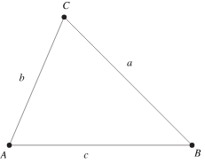
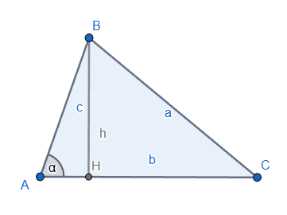

# \[Math\] Heron's Formula

## Công Thức

__Công thức Heron__ trình bày một cách thú vị khác để tính diện tích hình tròn.

<figure markdown="span">
    
    <figcaption>Tam giác</figcaption>
</figure>

__Công thức Heron's__ phát biểu như sau

!!! note "Heron's Formula"
    Với $s$ là <u>nửa chu vi</u> của tam giác thì lúc đó __*diện tích tam giác*__ $\Delta$ được tính bằng công thức:

    $$
    \Delta = \sqrt{s(s-a)(s-b)(s-c)}
    $$

- __Chu Vi__ tam giác $p = (a+b+c)$
- __Nửa Chu Vi__ tam giác $s = \cfrac{p}{2} = \cfrac{a+b+c}{2}$
- __Diện Tích__ tam giác $\Delta = \sqrt{s(s-a)(s-b)(s-c)}$

## Chứng Minh

### Biến Đổi

- Từ [Định luật Cosin](math-law-of-cosines.md), chứng minh với góc $A$ làm ví dụ:

Ta có:

$\cos{A} = \cfrac{b^2 + c^2 - a^2}{2bc}$

Mà $(\cos{A})^2 + (\sin{A})^2 = 1$

$\Rarr \sin{A} = \sqrt{(1 - \cos{A})(1 + \cos{A})}$

$\Harr \sin{A} = \sqrt{(1 - \cfrac{b^2 + c^2 - a^2}{2bc})(1 + \cfrac{b^2 + c^2 - a^2}{2bc})}$

$\Harr \sin{A} = \sqrt{\cfrac{2bc - (b^2 + c^2 - a^2)}{2bc} \times \cfrac{2bc + (b^2 + c^2 - a^2)}{2bc}}$

$\Harr \sin{A} = \cfrac{\sqrt{(2bc - b^2 - c^2 + a^2)(2bc + b^2 + c^2 - a^2)}}{2bc}$

$\Harr \sin{A} = \cfrac{\sqrt{2b^{2}c^{2} + 2a^{2}b^{2} + 2a^{2}c^{2} - a^4 - b^4 - c^4}}{2bc}$ (*)

### Tính Diện Tích

<figure markdown="span">
    
    <figcaption></figcaption>
</figure>

- Gọi diện tích tam giác: $\Delta = \cfrac{1}{2} \times hb$ (1)
- Lại có $\sin{\alpha} = \cfrac{h}{c} \Rarr h = c \times \sin{\alpha}$ (2)
- Từ $(1)$ và $(2)$ ta có $\Delta = \cfrac{1}{2} \times bc \sin{\alpha}$ (3)

### Chứnng Minh Công Thức

Thay $\sin{a}$ từ công thức $(*)$ vào $(3)$, ta có:

$\Delta = \cfrac{1}{2} \times bc \times \cfrac{\sqrt{2b^{2}c^{2} + 2a^{2}b^{2} + 2a^{2}c^{2} - a^4 - b^4 - c^4}}{2bc}$

$\Harr \Delta = \cfrac{\sqrt{2b^{2}c^{2} + 2a^{2}b^{2} + 2a^{2}c^{2} - a^4 - b^4 - c^4}}{4}$

$\Harr \Delta = \cfrac{\sqrt{{(2ab)}^{2} - (a^2 + b^2 - c^2)}}{4}$

$\Harr \Delta = \sqrt{\cfrac{(a+b+c)(-a+b+c)(a-b+c)(a+b-c)}{2}}$

$\Harr \Delta = \sqrt{\cfrac{a+b+c}{2} \times \cfrac{-a+b+c}{2} \times \cfrac{a-b+c}{2} \times \cfrac{a+b-c}{2}}$

Thay $s = \cfrac{p}{2} = \cfrac{a+b+c}{2}$, ta có:

$\Rarr \Delta = \sqrt{s(s-a)(s-b)(s-c)}$ _(đpcm)_