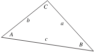

# \[Math\] Law of Cosines

## Phát Biểu

<figure markdown="span">
    
    <figcaption></figcaption>
</figure>

Cho $a, b, c$ là độ dài các cạnh của một tam giác, đối diện với các góc $A, B, C$. Ta có:

!!! note "Công Thức Tính Độ Dài Cạnh Theo $\cos{\angle}$"
    $$
    \def\foo#1#2#3#4{#1^2 = #2^2 + #3^2 - 2#2#3\cos{#4}}
    \foo{a}{b}{c}{A}\\[1em]
    \foo{b}{a}{c}{B}\\[1em]
    \foo{c}{a}{b}{C}\\[1em]
    $$

Giải các $\cos$ sẽ cho ra các công thức tương đương như sau:

!!! note "Tính $\cos{\angle}$ Bằng Độ Dài Cạnh"
    $$
    \def\foo#1#2#3#4{\cos{#1} = \cfrac{#3^2 + #4^2 - #2^2}{2#3#4}}
    \foo{A}{a}{b}{c}\\[1em]
    \foo{B}{b}{a}{c}\\[1em]
    \foo{C}{c}{a}{b}\\[1em]
    $$