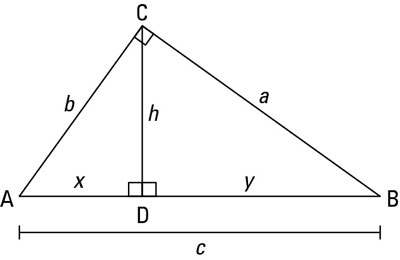
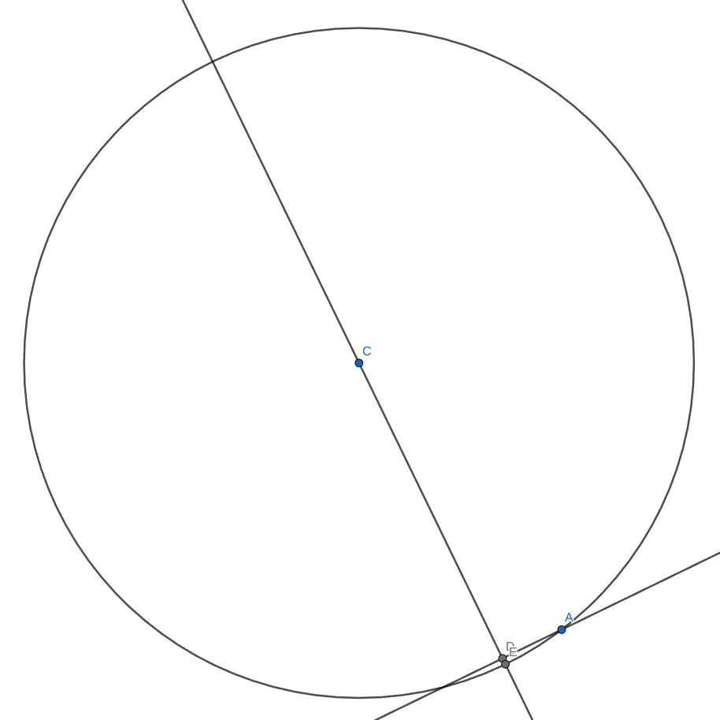
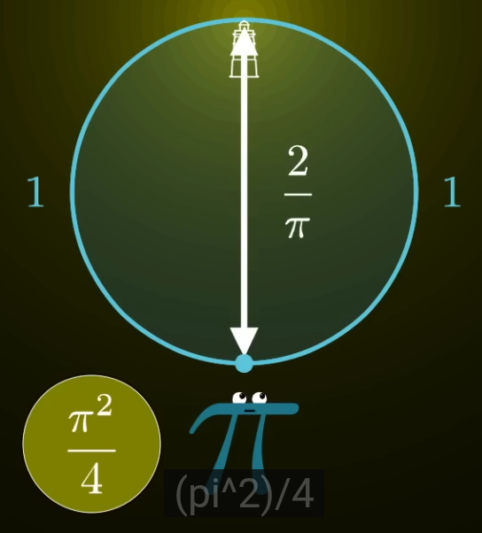
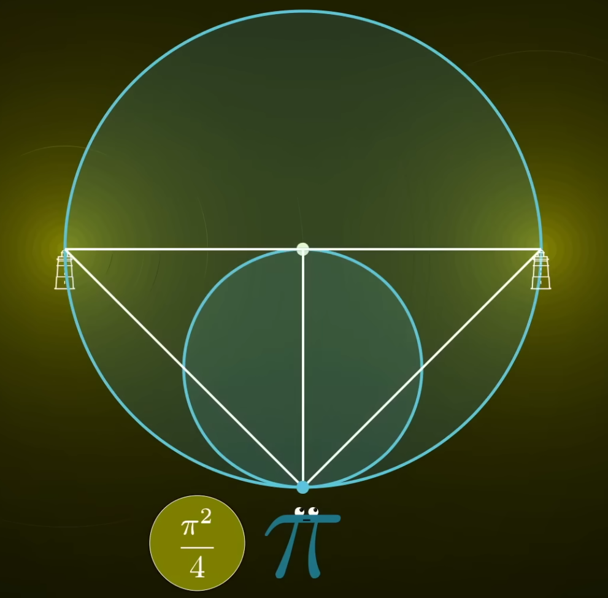
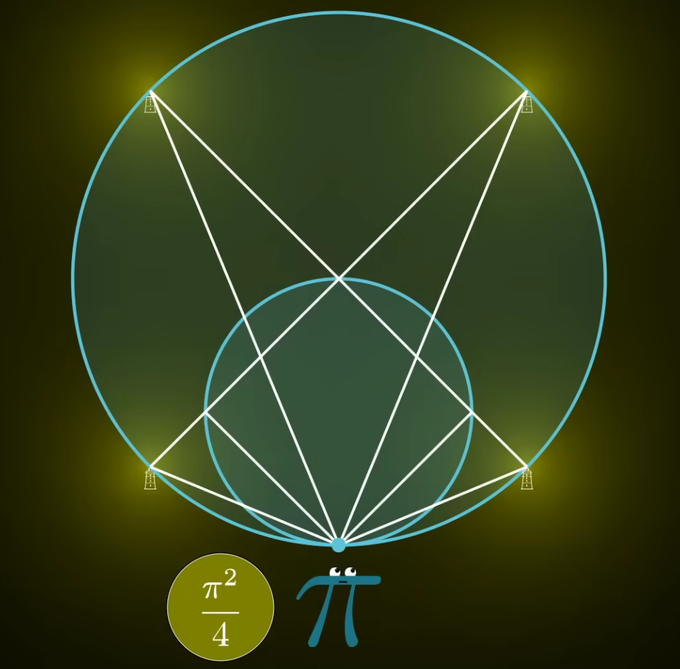
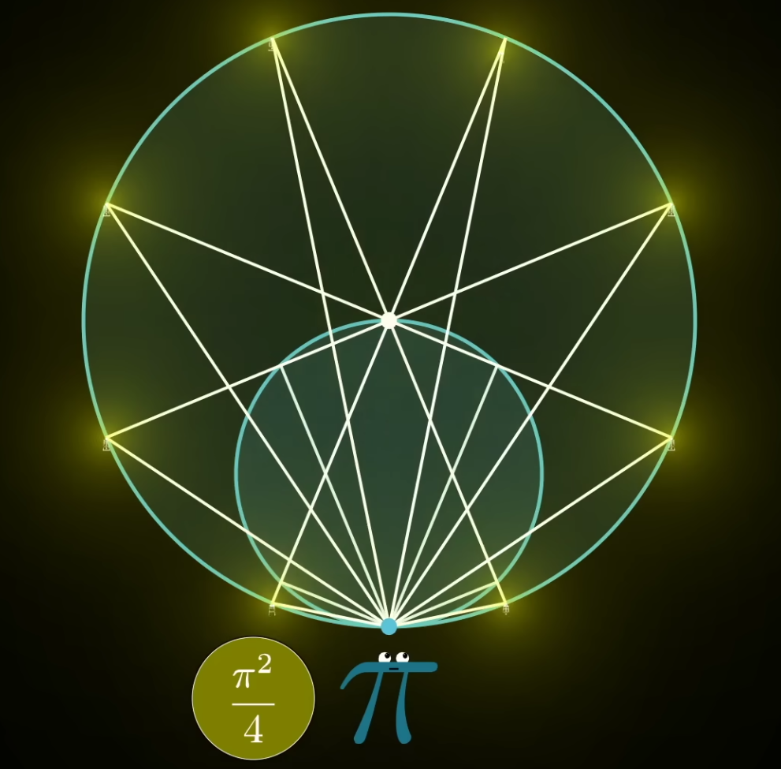
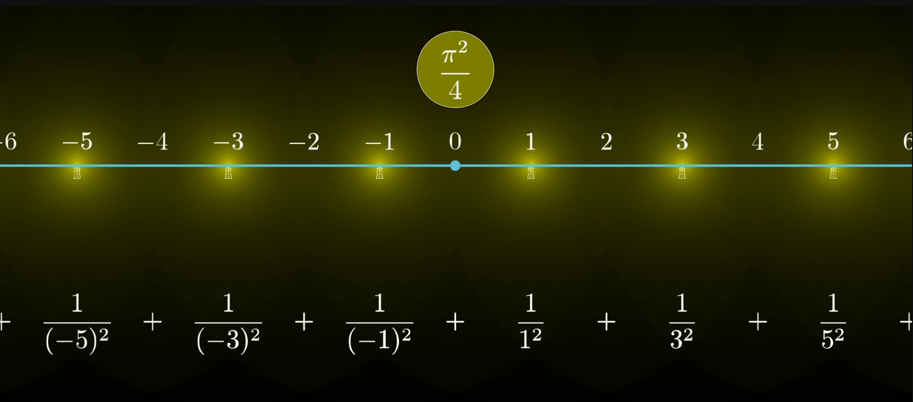
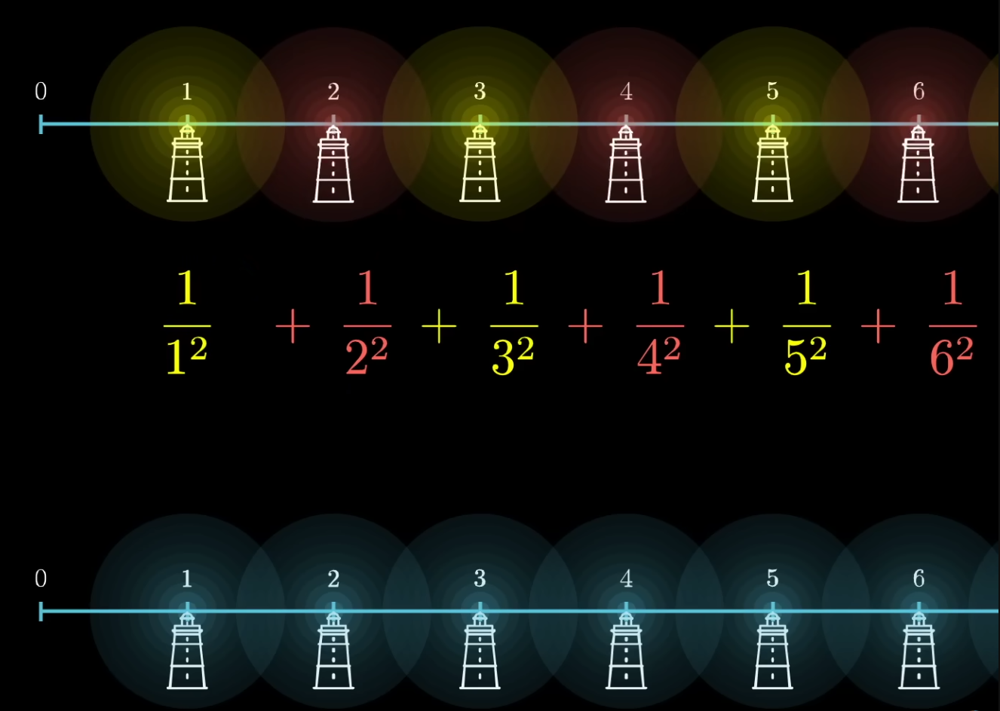

# \[Math\] Basel problem

## Vấn Đề Basel

Công thức cần chứng minh như sau.

$$
\displaystyle\sum_{N \rightarrow \infin}^{N=1} \cfrac{1}{N^2} = \cfrac{\pi^2}{6}
$$

Để giải bài toán này có nhiều cách. Cả cách bằng toán học lẫn hình học. Nhưng ở đây mình sẽ giải thích về mặt hình học vì nó rất thú vị, chứng minh một câu đố hóc búa bằng kiến thức cấp 2 là chủ yếu.

## Ngọn Hải Đăng

Để giải bài toán đầu tiên cần có một ngọn hải đăng làm ví dụ.

<figure markdown="span">
    
    <figcaption></figcaption>
</figure>

- Giả sử bạn quan sát ở vị trí $0$, ngọn hải đăng ở vị trí $1$ thì ánh sáng người đó nhận đến mắt là $1$
- Nếu ngọn hải đăng ở vị trí $2$, thì ánh sáng bị giảm tỉ lệ nghịch với bình phương khoảng cách, độ sáng lúc này bạn quan sát được là $\cfrac{1}{2^2} = \cfrac{1}{4}$
- Lần lượt các vị trí tiếp theo là $\cfrac{1}{2^2}; \cfrac{1}{3^2}; \cfrac{1}{4^2}; \dots = \cfrac{1}{4}; \cfrac{1}{9}; \cfrac{1}{16}; \dots$

## Định Lý Tam Giác

<figure markdown="span">
    
    <figcaption></figcaption>
</figure>

Trong tam giác vuông có đường cao như trên, ta có định lý sau:

$$
\cfrac{1}{h^2} = \cfrac{1}{a^2} + \cfrac{1}{b^2}
$$

## Tiến Đến Vô Cùng

Cuối cùng là khi bán kính đường tròn tiến đến vô cùng, độ dài của đoạn thẳng chiếu đến độ dài của cung bằng nhau:

<figure markdown="span">
    
    <figcaption></figcaption>
</figure>

Khi đường tròn có bán kính tiến đến $\infin$ thì độ dài của đoạn $AD$ và $AE$ tính là bằng nhau.

## Chứng Minh

### Bước 1

<figure markdown="span">
    
    <figcaption></figcaption>
</figure>

- Đầu tiên là xem xét ngọn hải đăng ở cách vị trí người quan sát có độ dài là $\cfrac{2}{\pi}$, làm vậy để độ dài cung tròn đến phía người quan sát có độ dài là 1.
- Độ sáng của đèn đến phía người quan sát là $\cfrac{\pi^2}{4}$

### Bước 2

<figure markdown="span">
    
    <figcaption></figcaption>
</figure>

- Sau đó từ một ngọn hải đăng đầu tiên, đổi thành hai ngọn hải đăng.
- Độ sáng từ hai ngọn hải đăng sau đó có cùng độ sáng với một ngọn hải đăng đầu tiên. Theo [Định Lý Tam Giác](#dinh-ly-tam-giac) để chứng minh.
- Khoảng cách mỗi đền đén phía người quan sát đều là $1$

### Bước 3

<figure markdown="span">
    
    <figcaption></figcaption>
</figure>

- Sau đó tiếp tục nhân bản từ 2 đèn lên 4 đèn.
- Khoảng cách hai đèn gần nhất đến phía người quan sát là 1 đơn vị nếu đi theo cung tròn.
- Giữa các đèn cách nhau là $2$ đơn vị

### Bước 4

<figure markdown="span">
    
    <figcaption></figcaption>
</figure>

- Tiếp tục nhân từ 4 lên 8 và tiếp tục ...
- Có thể lặp lại đến vô hạn.
- Có 2 điểm ở dưới đây cần chứng minh bằng hình học nhưng cũng không khó. Đó là:
    - Khoảng cách giữa các đèn đều vẫn là 2 nếu tính theo độ dài cung tròn _(nhớ kỹ điểm này)_
    - Riêng hai đèn gần nhất với người quan sát đều là 1
- Cuối cùng vì các đèn được nhân nhân bản thêm nên độ sáng vẫn giữ nguyên là $\cfrac{\pi^2}{4}$

### Bước 5

<figure markdown="span">
    
    <figcaption></figcaption>
</figure>

- Mở rộng đường tròn lên đến vô cùng, đường tròn mỗi lần liên tục mở rộng, số điểm cũng tiến đến vô cùng.
- Nhưng dù có đến bao nhiêu thì độ sáng đến phía người quan sát vẫn là $\cfrac{\pi^2}{4}$
- Từ đó ta dẫn đến hệ thức:

$$
... + \cfrac{1}{(-5)^2} + \cfrac{1}{(-3)^2} + \cfrac{1}{(-5)^1} + \cfrac{1}{1^2} + \cfrac{1}{3^2} + \cfrac{1}{5^2} + ... = \cfrac{\pi^2}{4}
$$

Loại bỏ phần lặp lại ở một nửa bên âm, ta có:

$$
\cfrac{1}{1^2} + \cfrac{1}{3^2} + \cfrac{1}{5^2} + \dots = \cfrac{\pi^2}{8}
$$

_Vẫn thiếu một nửa số dương nhỉ?_. Ta phải đi tìm chuỗi nguyên dương nhưng trước mắt tạm lưu nó lại:

$$
A = \cfrac{1}{1^2} + \cfrac{1}{3^2} + \cfrac{1}{5^2} + \dots = \cfrac{\pi^2}{8}
$$

Được rồi hãy xem xét lại công thức __Basel__

$$
B = \displaystyle\sum_{N \rightarrow \infin}^{N=1} \cfrac{1}{N^2} = \cfrac{1}{1^2} + \cfrac{1}{2^2} + \cfrac{1}{3^2} ...
$$

Được rồi giờ hãy chuyển chúng thành ngọn __hải đăng màu xanh như trong hình__:

<figure markdown="span">
    
    <figcaption></figcaption>
</figure>

Tiếp đến __nhân 2__ khoảng cách lên. Tính theo công thức độ sáng khoảng cách lên ta có công thức chuỗi chẵn, đèn màu đỏ:

$$
C = \cfrac{1}{2^2} + \cfrac{1}{4^2} + \cfrac{1}{6^2} + \dots
$$

Vì khoảng cách là nhân hai nên theo công thức về độ sáng, độ sáng giảm $\cfrac{1}{4}$, hay:

$$
C = \cfrac{1}{4} * B
$$

Mà chuỗi trên là chuỗi lẻ, cộng lại với chuỗi chẵn bằng đúng chuỗi __Basel__ nên có:

$$
A + C = B \iff A + \cfrac{1}{4} * B = B \iff A = \cfrac{3}{4} * B \iff B = \cfrac{4}{3} * A
$$

Thay $A = \cfrac{\pi^2}{8}$

$$
B = \cfrac{4}{3} * A \iff B = \cfrac{4}{3} * \cfrac{\pi^2}{8} \iff B = \cfrac{\pi^2}{6} (dpcm)
$$

## Refrence

- [Why is pi here? And why is it squared? A geometric answer to the Basel problem](https://www.youtube.com/watch?v=d-o3eB9sfls)